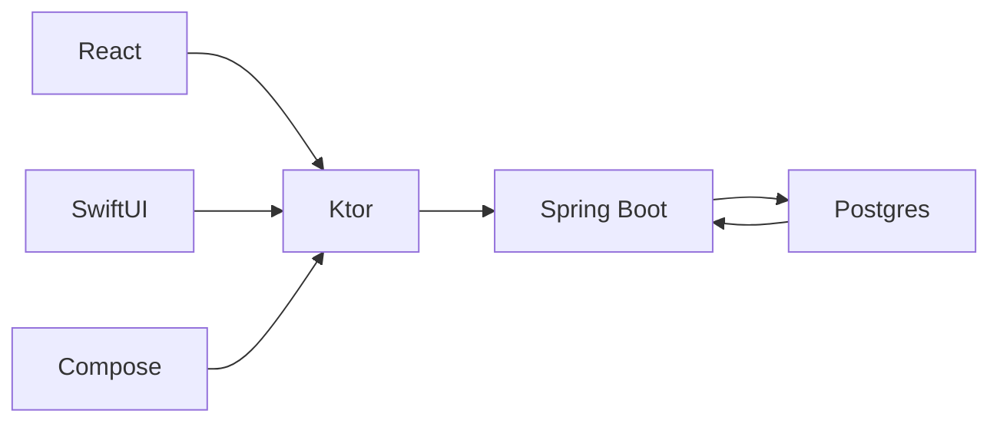
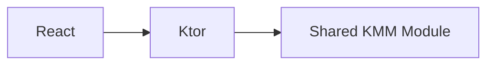
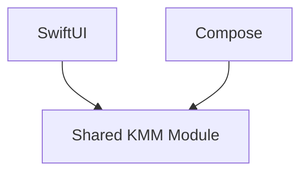
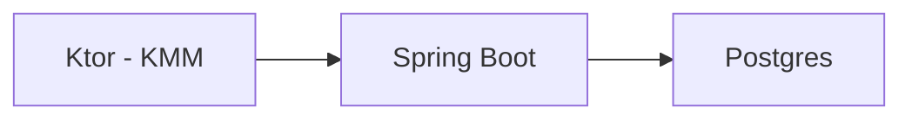

# Tic-Tac-Toe - Home

## Description
This project is a multiplatform Tic-Tac-Toe game that runs on the web using React, on iOS using SwiftUI, and on Android using Compose. It's built with Kotlin Multiplatform Mobile (KMM) and shares business logic across platforms. The backend is powered by a Kotlin-based Spring Boot application, with a PostgreSQL database for persistence.

## Architecture Diagrams

The architecture of the project is outlined below using Mermaid syntax. To render these diagrams, you will need to use a Markdown editor or viewer that supports Mermaid.

## Web Component
The web component is built using React. It communicates with the backend using Ktor, which is part of the shared KMM module.

## Mobile Components
The mobile components for iOS and Android are built using SwiftUI and Compose, respectively. They both utilize the shared KMM module to interact with the backend.

## Backend
The backend is a Spring Boot application written in Kotlin. It handles game logic and stores data in a PostgreSQL database.

