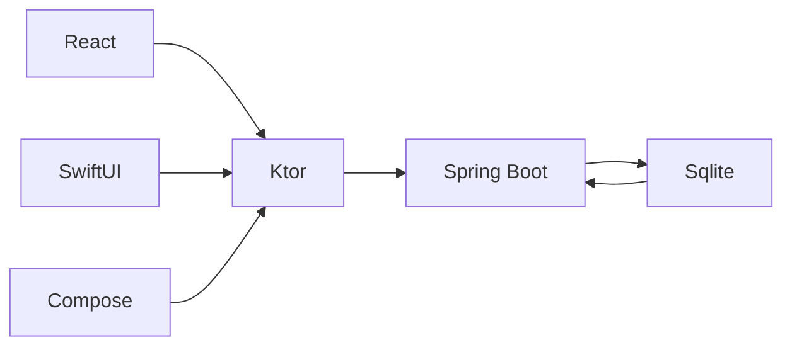
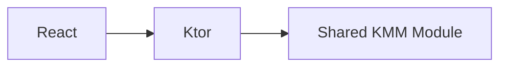
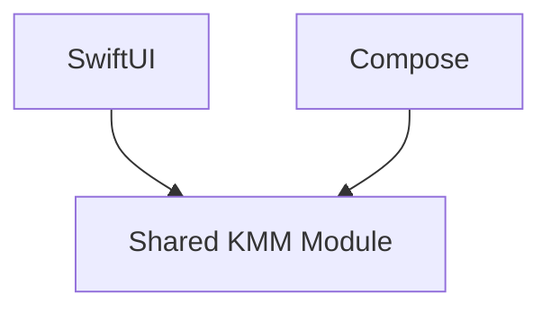
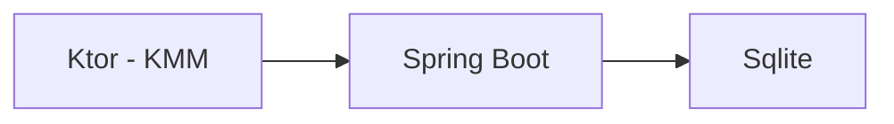

# Tic-Tac-Toe - Home

## Description

This project is a multiplatform Tic-Tac-Toe game that runs on the web using React, on iOS using SwiftUI, and on Android
using Compose. It's built with Kotlin Multiplatform Mobile (KMM) and shares business logic across platforms. The backend
is powered by a Kotlin-based Spring Boot application, with a Sqlite database for persistence.

MVP is without the Spring Boot layer since that is largely intended to be a learning exercise and isn't necessary for
the game to function.

## Architecture Diagrams

The architecture of the project is outlined below using Mermaid syntax. To render these diagrams, you will need to use a
Markdown editor or viewer that supports Mermaid.

The end goal is to have a service layer with Ktor for serving the web application and mobile applications. The service
layer will communicate with a backend written in Spring Boot. The backend will handle game logic and store data in a
Sqlite database.



## Web Application

The web application is built using React via
the [kotlin wrapper](https://github.com/JetBrains/kotlin-wrappers/tree/pre.430). This is a bit of an experiment since
some of the APIs are not 1-1 and the documentation is currently lacking. It communicates with the backend using Ktor,
which is part of the shared KMM module.



## Mobile Applications

The mobile applications for iOS and Android are built using SwiftUI and Compose, respectively. They both utilize the
shared KMM module to interact with the backend.



## Backend (Not Implemented)

The backend will be a Spring Boot application written in Kotlin. It handles game logic and stores data in a Sqlite
database. The plan is to also implement web sockets for real-time gameplay.



## Running the Application

First, clone the project and navigate to the root of the project:

```shell
git clone https://github.com/JH108/TicTacToe.git
cd TicTacToe
```

The easy way is to install [Intellij IDEA Community Edition](https://www.jetbrains.com/idea/download/?section=mac) and open the project. Then select the run configuration called `Run` and click the green play button.

Another option is if you've got Java 17 or greater installed, you can run the following command from the root of the project:

```shell
./gradlew run
```

If you haven't installed Java but want the experience then I recommend using [SDKMAN](https://sdkman.io/) to install it. Once you've installed SDKMAN, run the following command (or read the sdkman docs):

```shell
sdk install java 17.0.0-zulu
```

## Demo

