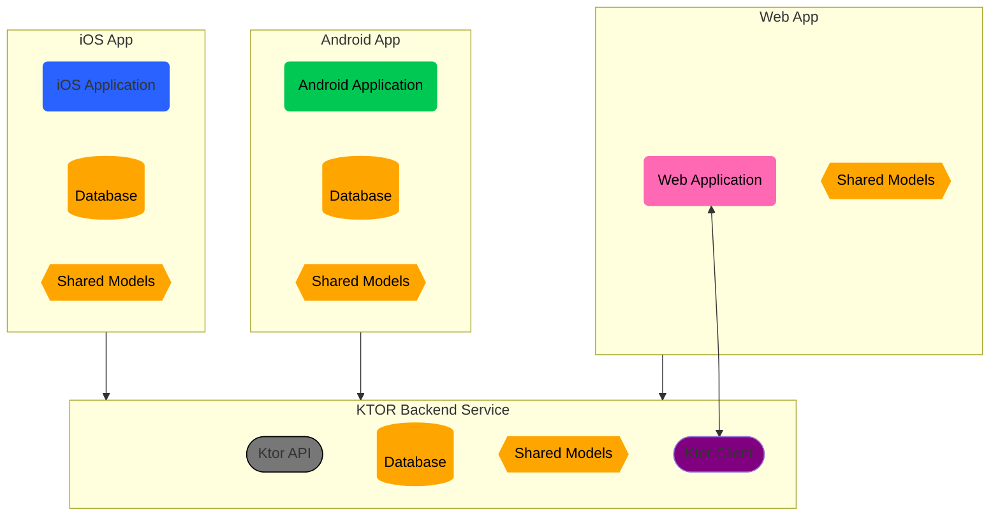

# TicTacToe
Built with Kotlin Multiplatform, Ktor, Jetpack Compose, Swift UI, and Kotlin React Wrapper. 

# Status
- [x] Backend Implemented 
- [x] Web Frontend Implemented 
- [x] Android Frontend Implemented 
- [ ] Android Frontend "best practices" 
- [ ] iOS Frontend Implemented 
- [ ] Backend "productionized" 

# Diagrams

## High Level Architecture
